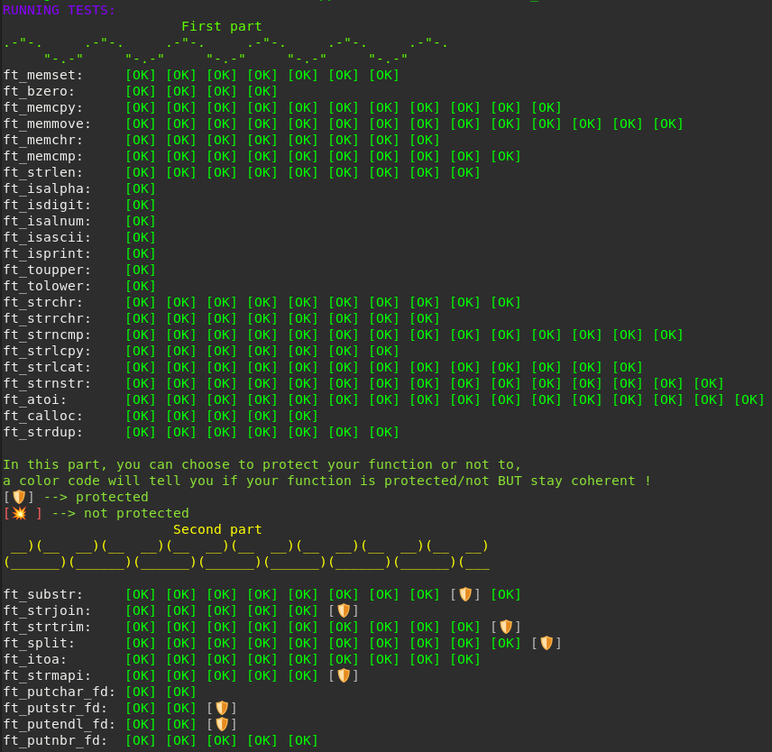
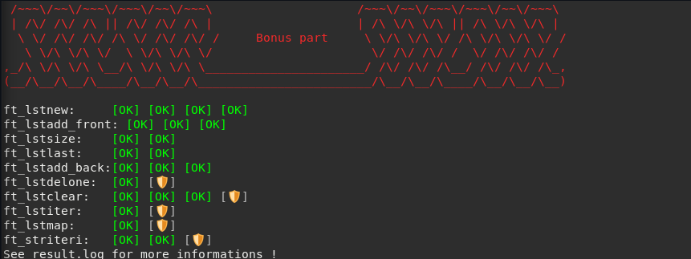
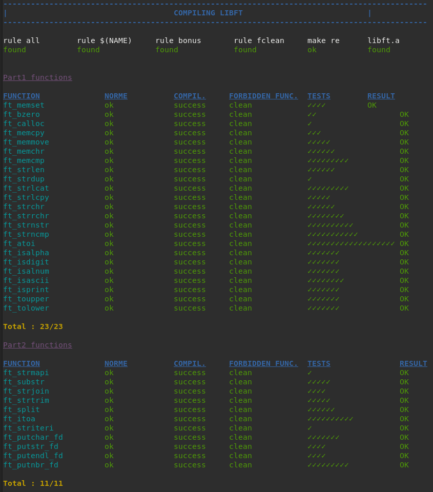
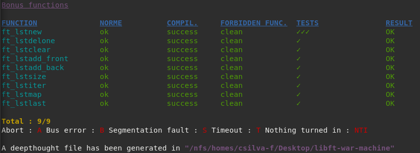

# *libft* (42cursus_lvl0)
## Grade: 125/100
### Subject: [click here](Extras/en.subject.pdf)

This repository includes all the functions from the libft individual project from 42 cursus (level 0).<br />
The goal was to create a library which would include the mostly used C functions, such as strlen, strchr, atoi, etc.<br />
This library will then be useful for future projects, in which it is allowed to use it and will be improved with the addition of new functions.<br />

### To run the project:
1 - Clone the repository:<br />
```
$ git clone https://github.com/carolinaaasf/42cursus_lvl0_Libft.git
```

2 - Navigate to the repository folder and run `make`<br />
`make`<br />

3 - You can run `make clean` to remove object files that are no longer needed.<br />
`make clean` <br />

4- Compile your main.c with your new libft.a <br />
`cc -Wall -Wextra -Werror main.c libft.a`

### Testing:
For this project, I ran 2 testers created by other users, which results and repositories are the ones below:<br />
#### [libft-unit-test](https://github.com/alelievr/libft-unit-test) <br />
 <br />
 <br />

#### [libft-war-machine](https://github.com/0x050f/libft-war-machine) <br />
 <br />
 <br />
--------
Carolina Figueiredo (carolinaaasf) | csilva-f@student.42porto.com <br />
LinkedIn: https://www.linkedin.com/in/carolina-silva-figueiredo/
